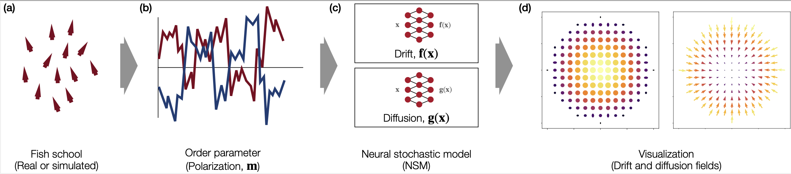

# Neu_sde
Code to paper: Discovering mesoscopic descriptions of collective animal movement with neural stochastic modelling

# ACKNOWLEGDEMENT
I used: [Link](https://gitlab.com/felix.dietrich/sde-identification/-/tree/master/) as a reference for my work
